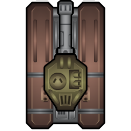

[![Contributors][contributors-shield]][contributors-url]
[![Forks][forks-shield]][forks-url]
[![Stargazers][stars-shield]][stars-url]
[![Issues][issues-shield]][issues-url]
[![MIT License][license-shield]][license-url]
[![LinkedIn][linkedin-shield]][linkedin-url]

<!-- PROJECT LOGO -->
 

  

  <h3 align="center">Rogue Tanks: Shooter Game</h3>

  

    A shooter game developed with phaser 3.5 game development framework
     
    <a href="https://github.com/Berabjesus/Tank-Shooter-Game"><strong>Explore the docs »</strong></a>
     
     
    <a href="">View Demo</a>
    ·
    <a href="https://github.com/Berabjesus/Tank-Shooter-Game/issues">Report Bug</a>
    ·
    <a href="https://github.com/Berabjesus/Tank-Shooter-Game/issues">Request Feature</a>
  

<!-- TABLE OF CONTENTS -->
 # Table of Contents 

  <ol>
    <li>
      <a href="#about-the-project">About The Project</a>
      <ul>
        <li><a href="#Instructions">Instructions</a></li>
        <li><a href="#Live">Live Demo</a></li>
        <li><a href="#built-with">Built With</a></li>
      </ul>
    </li>
    <li>
      <a href="#getting-started">Getting Started</a>
      <ul>
        <li><a href="#Prerequisites">Prerequisites</a></li>
        <li><a href="#Installation">Installation</a></li>
        <li><a href="#Testing">Testing</a></li>
        <li><a href="#Other-Info">Other information</a></li>
      </ul>
    </li>
    <li><a href="#roadmap">Author</a></li>
    <li><a href="#contributing">Contributing</a></li>
    <li><a href="#license">License</a></li>
    <li><a href="#contact">Contact</a></li>
    <li><a href="#acknowledgements">Acknowledgements</a></li>
  </ol>

<!-- ABOUT THE PROJECT -->
## About The Project

This tank shooter game is developed using the [Phaser](https://phaser.io/) Javascript framework. The requirement for this project is stated [here](https://www.notion.so/Shooter-game-203e819041c7486bb36f9e65faecba27). Under the hood, Javascript ES6 is the main programming language used. The inspiration behind this project is to create a browser game that look like a classic retro game by applying fundamental game development guidelines and designs as well as structured and readable code.

### Instructions
You will start this game by having control of a tank to move around and destroy enemy tanks. Read the control instruction carefully below.
- The game starts by loading and asking you to insert your name. After that, click on the Play button and start the game.
- You will be spawned on the bottom right corner of your screen. 
- From there, you can navigate and move forward and backward using `W` and `S` keys. You can rotate the tank body using `A` and `D` keys.
- The [turret](https://bitsofwar.com/3214-thickbox_bosky/legionary-assault-tank-turret-heavy-autocannon.jpg) of the tank is the body part that fire bullets or cannons. You have to rotate it using your mouse button.
- To fire, `point` your cursor on an enemy tank with your mouse and `click` on it or hit the `spacebar` key.
- Enemy tanks are designed to chase you if you get close to them. They are faster in general, but you can boost your speed using the `E` key.
- Your score and health are displayed on the top left and top right part of the screen respectively.
- Your health will regenerate if your hit. 
- When you die, you can restart the game or head back to the menu. Either way, your score, and name will be uploaded to the leaderboard API. 
- On the menu screen, you can navigate to the options screen to turn audio on/off. The credits screen will show information regarding the developer, and the leaderboard screen will fetch scores.

### Live Demo
[Play the game live]()

### Built With

* [Phaser 3.5](https://phaser.io/)
* Javascript ES6
* Canvas
* SCSS
* HTML
* npm
* Webpack
* Jest
* Eslint
* Babel
* [Tiled Map Editor](https://www.mapeditor.org/)

<!-- GETTING STARTED -->
## Getting Started

To set this project upon a local environment clone, or download this repo and follow the instructions below.

### Prerequisites
- Web browser
- CLI tool
- npm
  `npm install npm@latest -g`
  
Note: Some browsers may have their GPU hardware acceleration turned off. You have to turn this feature or for a smooth gaming experience. For example, use [this](https://www.lifewire.com/hardware-acceleration-in-chrome-4125122) instruction to turn chromes GPU feature on if you experience a lag

### Installation
1. Navigate to the root folder of your local copy and, using any CLI tool, type `npm i`, and press Enter. This will install the dependencies.
2. After that is completed, 
- If you want to repack the file
  - Run `npm run build` to pack the files in the src folder
  - Go to the build folder and open index.html
- Else
  - Run `npm run start` to open it on a live server. NB The port is set to 3003. 

### Testing
- Navigate to the root folder of your local copy and type `npm run test` to run jest.
- You can add more tests in the `./test` directory.
### other information
- I have used underscore score to identify private properties and methods in some classes. As you can see in this [eslint documentation](https://eslint.org/docs/rules/no-underscore-dangle) it's purely a preference. and I have disabled the respective eslint rules off.

- I have commented out `  pixelArt: true, roundPixels: true,` rules but feel free to uncomment them, remove the `/*` and `*/`, before and after them to enable the retro look.

<!-- CONTRIBUTING -->
## Contributing

Contributions are what make the open source community such an amazing place to be learn, inspire, and create. Any contributions you make are **greatly appreciated**.

1. Fork the Project
2. Create your Feature Branch (`git checkout -b feature/AmazingFeature`)
3. Commit your Changes (`git commit -m 'Add some AmazingFeature'`)
4. Push to the Branch (`git push origin feature/AmazingFeature`)
5. Open a Pull Request

## Author

👤 **Bereket Beshane**

- Github: [@Berabjesus](https://github.com/Berabjesus)
- Twitter: [@bereket_ababu_b](https://twitter.com/bereket_ababu_b)
- Linkedin: Linkedin: [linkedin](https://www.linkedin.com/in/bereketbeshane/) 

<!-- LICENSE -->
## License

This project is [MIT]('./LICENSE.txt') licensed.

## Show your support

Give a ⭐️ if you like this project!

<!-- ACKNOWLEDGEMENTS -->
## Acknowledgements
* [Microverse](Microverse.org)
* [Phaser.io](https://phaser.io/)
* [Tiled Map Editor](https://www.mapeditor.org/)

[contributors-shield]: https://img.shields.io/github/contributors/Berabjesus/Tank-Shooter-Game.svg?style=for-the-badge
[contributors-url]: https://github.com/Berabjesus/Tank-Shooter-Game/graphs/contributors
[forks-shield]: https://img.shields.io/github/forks/Berabjesus/Tank-Shooter-Game.svg?style=for-the-badge
[forks-url]: https://github.com/Berabjesus/Tank-Shooter-Game/network/members
[stars-shield]: https://img.shields.io/github/stars/Berabjesus/Tank-Shooter-Game.svg?style=for-the-badge
[stars-url]: https://github.com/Berabjesus/Tank-Shooter-Game/stargazers
[issues-shield]: https://img.shields.io/github/issues/Berabjesus/Tank-Shooter-Game.svg?style=for-the-badge
[issues-url]: https://github.com/Berabjesus/Tank-Shooter-Game/issues
[license-shield]: https://img.shields.io/github/license/Berabjesus/Tank-Shooter-Game.svg?style=for-the-badge
[license-url]: https://github.com/Berabjesus/Tank-Shooter-Game/blob/main/LICENSE.txt
[linkedin-shield]: https://img.shields.io/badge/-LinkedIn-black.svg?style=for-the-badge&logo=linkedin&colorB=555
[linkedin-url]: https://www.linkedin.com/in/bereketbeshane/
[product-screenshot]: public/logo1.png
